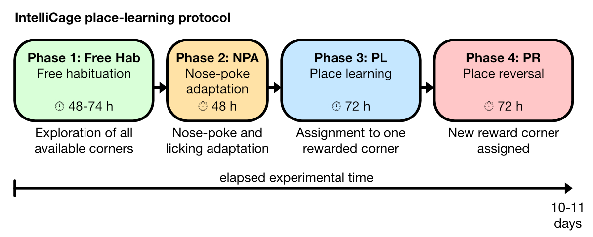

# IntelliCage Place Learning Toolkit

A Python toolkit for analyzing place learning experiments conducted in the *IntelliCage*.

The package provides reusable tools to load *IntelliCage* results exports, merge mouse metadata with visit and nose-poke records, compute place-learning and reversal-learning metrics, and create publication-oriented summary plots.

This public repository uses synthetic example data only. Real experimental cohort data are intentionally not included.

## Experiment protocol
The default place-learning workflow follows a four-phase *IntelliCage* protocol
on an aligned 0-266 h analysis timeline:



- Phase 1, Free Hab: 0-74 h, free habituation and exploration of all corners. This may vary from 48-74 h depending on the experiment design.
- Phase 2, NPA: 74-122 h, nose-poke adaptation and licking behavior.
- Phase 3, PL: 122-194 h, place learning with an assigned rewarded correct
  corner.
- Phase 4, PR: 194-266 h, place reversal with a new rewarded corner and
  tracking of visits to the previous correct corner.

## Installation
Create a clean environment and install the package in editable mode:

```bash
conda create -n ic_placelearning python=3.12 -y
conda activate ic_placelearning
pip install -e .
```

For development and documentation work:

```bash
pip install -e ".[dev]"
```

## Package structure
The import package is `ic_placelearning`:

- `ic_placelearning.loader` Reads *IntelliCage*-style `Mice.txt`, `Visits.txt`, and `Nosepokes.txt` files, merges metadata, and adds experiment-relative timing and event annotations.
- `ic_placelearning.metrics` Computes activity, place-learning, reversal-learning, responder, onset, and group-comparison summary tables.
- `ic_placelearning.plotting` Creates group-level and mouse-level figures from the computed metric tables.

Example import:

```python
from pathlib import Path

from ic_placelearning.loader import load_cohort_data

cohort = load_cohort_data(
    Path("example_data/synthetic_group_ab_place_learning"),
    group_names=["Group A", "Group B"])
print(cohort.visits.head())
```

## Synthetic example data
The repository includes a small synthetic *IntelliCage*-style dataset at:

```text
example_data/synthetic_group_ab_place_learning
```

It contains two groups with ten pseudo-mice each:

- `Group A`: simulated stronger place learning and better reversal adaptation.
- `Group B`: simulated weaker place learning and stronger phase-4 perseveration at the previous correct corner.

The dataset follows the same folder layout expected from real *IntelliCage*
exports:

```text
GruppeA/
  Mice.txt
  Phase1/IntelliCage/Visits.txt
  Phase1/IntelliCage/Nosepokes.txt
  ...
GruppeB/
  Mice.txt
  Phase1/IntelliCage/Visits.txt
  Phase1/IntelliCage/Nosepokes.txt
  ...
```

To regenerate the example data:

```bash
conda run -n ic_placelearning python additional_scripts/generate_synthetic_group_ab_data.py --overwrite
```

## Demo analysis
Run the public synthetic-data workflow with:

```bash
conda run -n ic_placelearning python user_scripts/analyze_synthetic_group_ab.py
```

The script writes compact result tables and figures to:

```text
example_data/synthetic_group_ab_place_learning/results
```

Generated result folders are ignored by Git. They can be safely recreated from the synthetic input data and analysis script.

## Metric definitions
The workflow keeps several place-learning metrics in parallel:

- `correct_corner_visit_rate`  
  Visits in the assigned correct corner divided by all visits.
- `correct_np_visit_rate`  
  Correct-corner visits with at least one nose-poke divided by all visits.
- `rewarded_correct_corner_visit_rate`  
  Correct-corner visits with nose-poke and licking divided by all visits.
- `matlab_placeerror_only`  
  Legacy-compatible definition based on `PlaceError == 0`.

For phase 4, the toolkit also separates:

- visits to the new correct corner
- visits to the previous correct corner
- visits to the neutral incorrect corners

## Time alignment
The analysis distinguishes raw *IntelliCage* phase files from an aligned analysis timeline:

- phase files preserve the observed *IntelliCage* export structure
- analysis windows can follow a protocol schedule in elapsed hours
- mouse-day and awake/sleep windows can be configured for plotting and daily summaries

This makes runs with slightly different recording boundaries comparable on a
common experiment timeline.


## Where to start
We recommend to start with usage examples on the documentation website. The folder `user_scripts/` contains interactive scripts that are described in the documentation and can be run cell by cell in VS Code's interactive window or in a notebook-like environment. They are designed to be run with provided example datasets (download from [Zenodo](https://doi.org/10.5281/zenodo.22181525)) or with your own *IntelliCage* data.

## Citation
If you use the *IntelliCage Place Learning Toolkit* in scientific work, please cite it as follows:

> Musacchio, F. (2026). *IntelliCage Place Learning Toolkit: A Python toolkit for analyzing place learning experiments conducted in the IntelliCage.*. Zenodo. https://doi.org/10.5281/zenodo.22181525

<!-- Please also cite the archived IntelliCage Place Learning Toolkit software version used in your analysis:

> Musacchio, F. (2026). *IntelliCage Place Learning Toolkit: A Python package for analyzing place learning experiments in the IntelliCage*. Zenodo. https://doi.org/10.5281/zenodo.22181525

Zenodo software archive:
[https://doi.org/10.5281/zenodo.22181525](https://doi.org/10.5281/zenodo.22181525) -->
