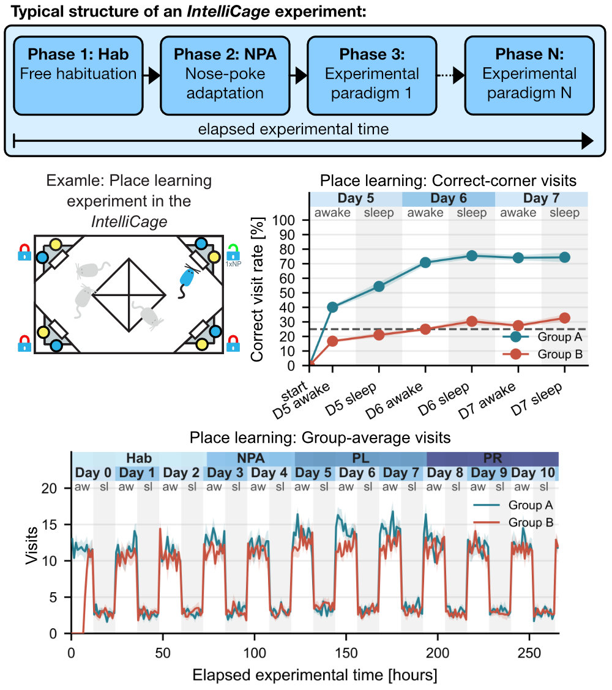

IntelliCage Analysis Toolkit documentation
================================================

.. figure:: _static/figures/logo.png
   :alt: CellColoc overview
   :align: center
   :figwidth: 60%

|

.. image:: https://badgen.net/badge/icon/GitHub%20repository?icon=github&label
   :target: https://github.com/FabrizioMusacchio/ic-analysis/
   :alt: GitHub repository

.. image:: https://img.shields.io/github/v/release/FabrizioMusacchio/ic-analysis
   :alt: GitHub Release

.. image:: https://img.shields.io/pypi/v/ic-analysis.svg
   :target: https://pypi.org/project/ic-analysis/
   :alt: PyPI version

.. image:: https://img.shields.io/badge/License-GPL%20v3-green.svg
   :target: https://github.com/FabrizioMusacchio/ic-analysis
   :alt: GPLv3 License

.. image:: https://github.com/FabrizioMusacchio/ic-analysis/actions/workflows/ic_analysis_tests.yml/badge.svg
   :alt: Tests

.. image:: https://img.shields.io/github/last-commit/FabrizioMusacchio/ic-analysis
   :target: https://github.com/FabrizioMusacchio/ic-analysis/commits/main/
   :alt: GitHub last commit

.. image:: https://img.shields.io/github/issues/FabrizioMusacchio/ic-analysis
   :target: https://github.com/FabrizioMusacchio/ic-analysis/issues
   :alt: GitHub Issues Open

.. image:: https://img.shields.io/github/issues-pr/FabrizioMusacchio/ic-analysis
   :target: https://github.com/FabrizioMusacchio/ic-analysis/pulls
   :alt: GitHub Issues or Pull Requests

.. image:: https://img.shields.io/github/languages/code-size/fabriziomusacchio/ic-analysis
   :alt: GitHub code size in bytes

.. image:: https://img.shields.io/pypi/dm/ic-analysis?logo=pypy&label=PiPY%20downloads&color=blue
   :target: https://pypistats.org/packages/ic-analysis
   :alt: PyPI Downloads

.. image:: https://static.pepy.tech/personalized-badge/ic-analysis?period=total&units=INTERNATIONAL_SYSTEM&left_color=GRAY&right_color=BLUE&left_text=PiPY+total+downloads
   :target: https://pepy.tech/projects/ic-analysis
   :alt: PyPI Total Downloads

.. image:: https://img.shields.io/badge/Example%20Datasets-10.5281%2Fzenodo.22518261-blue
   :target: https://doi.org/10.5281/zenodo.22518261
   :alt: Example Datasets on Zenodo

.. image:: https://img.shields.io/badge/Zenodo%20Archive-10.5281%2Fzenodo.22181525-blue
   :target: https://doi.org/10.5281/zenodo.22181525
   :alt: Zenodo Archive

The IntelliCage Analysis Toolkit is a Python package for analyzing IntelliCage
experiments. It reads exported ``Visits.txt`` and ``Nosepokes.txt`` tables,
combines them with script-defined experiment and subject metadata, computes behavioral metrics, and creates
publication-oriented summary plots. 

The toolkit is designed around a central ``Experiment`` object that contains all 
the relevant data and metadata for a given experiment. The toolkit provides methods 
to load data, prepare it for analysis, compute metrics, and generate plots. Its
main goal is to make IntelliCage data analysis more standardized, reproducible, and 
accessible:

.. code-block:: python

   import ic_analysis as ic

   my_pl_exp = ic.experiment(EXPERIMENT=EXPERIMENT, PHASES=PHASES, SUBJECTS=SUBJECTS)
   my_pl_exp.load()
   my_pl_exp.prepare_analysis()
   my_pl_exp.plot_mice_activity()

.. toctree::
   :maxdepth: 3
   :caption: Contents

   overview
   installation
   usage
   api
   changelog
   contributing
