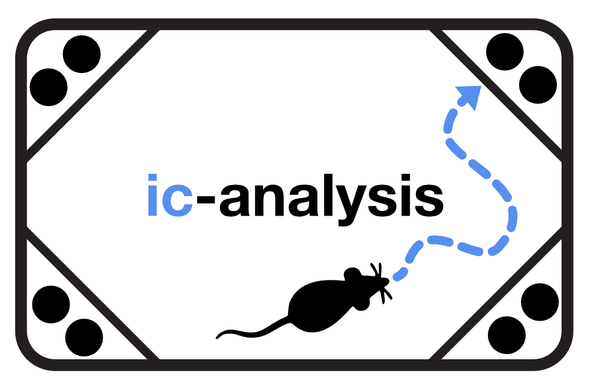

Overview
========

The IntelliCage Analysis Toolkit ``ic-analysis`` is a script-oriented analysis package for
IntelliCage experiments. Place learning and reversal are the first supported
workflow, but the package is organized around a more general idea: user scripts
define experiment metadata and subject metadata, while reusable experiment
objects turn raw IntelliCage text exports into reproducible tables and figures.

|

The public workflow is intentionally based on synthetic data. The synthetic
dataset follows the same cage-run and export-block layout as real IntelliCage
exports, but the values are pseudo-data generated for documentation, demos, and
tests. This makes the full pipeline usable without distributing private
experimental cohorts.

Workflow philosophy
-------------------

The package separates the workflow into explicit layers:

- ``ic_analysis.metadata`` defines phases, group order, colors, subject IDs,
  true IDs, phase windows, and task-specific assignments in the user script.
- ``ic_analysis.experiment`` provides the base object that validates metadata,
  loads raw exports, and keeps cohort tables attached to one experiment.
- PL/PR-specific methods live on the generic experiment object with
  ``plot_plr_*`` names, while generic methods such as activity, age, and bottle
  preference remain experiment-agnostic.
- ``ic_analysis.metrics`` aggregates visit-level events into mouse-level and
  group-level summaries.
- ``ic_analysis.plotting`` turns summary tables into publication-oriented
  figures.

This design keeps user scripts readable while preserving the important
scientific choices in code: subject inclusion, phase timing, group display
names, group colors, bin size, awake/sleep windows, and the exact success
metric used for learning curves.

Core data model
---------------

The loader expects each cage run to be represented by one direct subfolder of
the dataset root. A cage-run folder is detected when it contains one or more
technical export blocks with ``IntelliCage/Visits.txt`` files. This avoids
hard-coded assumptions about whether folders are named ``GroupA``, ``Run01``,
``Cohort_A``, or something else.

Within each run experiment for a specific cage, the default export-block layout
is:

.. code-block:: text

   GroupA/
   |-- Export_Block_1/
   |   `-- IntelliCage/
   |       |-- Visits.txt
   |       `-- Nosepokes.txt
   |-- Export_Block_2/
   |   `-- IntelliCage/
   |       |-- Visits.txt
   |       `-- Nosepokes.txt
   |-- Export_Block_3/
   |   `-- IntelliCage/
   |       |-- Visits.txt
   |       `-- Nosepokes.txt
   `-- Export_Block_4/
       `-- IntelliCage/
           |-- Visits.txt
           `-- Nosepokes.txt

.. note::

   The export-block folder structure is prepared by the user, not by
   IntelliCage itself. Export blocks are technical pieces of raw data, not
   biological phases. After loading, the toolkit concatenates all detected
   blocks and assigns protocol phases from the subject-level ``time_window``
   definitions.

After ``my_exp.load()``, the returned ``CohortData`` object is attached to the
experiment and stores four tables:

.. list-table::
   :header-rows: 1

   * - Table
     - Meaning
     - Typical use
   * - ``metadata``
     - One row per registered mouse and run group, built from script-defined
       subject metadata.
     - Group filtering, group labels, mouse-level joins, and age summaries.
   * - ``visits``
     - One row per visit, merged with metadata and visit-linked nose-poke
       summaries.
     - Main source table for activity, learning, reversal, and time-window
       metrics.
   * - ``nosepokes``
     - Raw nose-poke events read from ``Nosepokes.txt``.
     - Event-level analyses such as side-specific licking.
   * - ``phase_manifest``
     - Observed start, end, visit count, and mouse count per run group and raw
       export block.
     - Checking raw export coverage and troubleshooting interrupted recordings.

Subject metadata and inclusion policy
-------------------------------------

Group labels, true IDs, sex, age or date of birth, subject-specific phase time
windows, and PL/PR corner assignments should be set in user scripts or a
user-edited subject YAML file rather than hidden in package internals or
separate hand-written text tables. Only raw IntelliCage animal IDs with a
matching subject entry are analyzed.

.. code-block:: python

   import ic_analysis as ic

   my_pl_exp = ic.experiment(EXPERIMENT=EXPERIMENT, PHASES=PHASES, SUBJECTS=SUBJECTS)
   my_pl_exp.load()

This policy makes public example scripts self-contained and makes real analyses
easier to audit: the script itself states which animals are included and how
they should be interpreted.

Metric philosophy
-----------------

The toolkit keeps several related learning definitions available because they
answer slightly different questions:

- ``correct_corner_visit`` asks whether a visit occurred in the assigned
  target corner.
- ``correct_np_visit`` additionally requires at least one nose-poke.
- ``rewarded_correct_corner_visit`` requires the assigned corner, a nose-poke,
  and licking behavior.
- ``matlab_placeerror_only`` preserves the legacy ``PlaceError == 0`` style
  definition when compatibility with older analyses is needed.

For reversal learning, the toolkit separates visits to the new correct corner,
the previous correct corner, and neutral incorrect corners. This makes phase 4
interpretable as both new learning and perseveration away from the previously
rewarded corner.

Time alignment
--------------

Raw IntelliCage export blocks reflect how the data were exported, stopped, or
restarted, while analyses need comparable protocol windows. The toolkit
therefore keeps both concepts:

- raw export-block columns preserve the exported file identity;
- analysis-time columns assign phases from the subject-level ``time_window``
  definitions;
- mouse-day columns and awake/sleep background shading make daily activity
  patterns visible in plots.

This means a seven-week experiment can be loaded from one uninterrupted export
block, from several interrupted export blocks, or from export blocks that happen
to match the biological phases. The downstream analysis uses the same
``AnalysisPhaseNumber`` columns in all cases.

The synthetic example uses the default 0-266 h protocol:

.. image:: _static/figures/intellicage_place_learning_protocol.jpg
   :alt: IntelliCage place-learning protocol
   :align: center
   :width: 100%

Why another IntelliCage analysis tool?
--------------------------------------

The IntelliCage field already has important analysis tools, and
``ic-analysis`` is not meant to replace them. `PyMICE
<https://github.com/Neuroinflab/PyMICE>`_ provides an open Python library for
loading and working with IntelliCage data. `IntelliPy
<https://doi.org/10.1093/bioinformatics/btab682>`_ offers a graphical
interface for common IntelliCage analyses, making analysis more accessible for
users who do not want to build scripts. More recently, `IntelliR
<https://github.com/vgastaldi/IntelliR>`_ introduced a standardized R pipeline
for automated profiling of higher cognition in IntelliCage experiments
(`Cell Reports Methods, 2025 <https://doi.org/10.1016/j.crmeth.2025.101011>`_;
`STAR Protocols, 2025 <https://doi.org/10.1016/j.xpro.2025.104246>`_).

``ic-analysis`` takes a complementary position. It is script-oriented like a
Python analysis workflow, but aims to provide more than a raw data-access layer:
the user defines the experiment, phases, subjects, and selected analyses in a
versionable user script, while the reusable core handles loading, biological
time alignment, metric calculation, plotting, and reproducible outputs. It is
also intentionally broader than one fixed challenge protocol. Place learning
and reversal are the first worked examples, but the same structure is designed
to support general activity, exploration, drinking and reward-related readouts,
cognitive assays, and social or group-embedded experiments as new modules are
added.

In short, ``ic-analysis`` should be read as a modular, auditable, and
community-extensible workflow layer rather than as a repetition of already 
existing tools. 

The conceptual motivation and comparison to existing
approaches are discussed in more detail in the accompanying preprint.

License
-------

The IntelliCage Analysis Toolkit is distributed under the terms of the
GNU General Public License v3.0 or later.

In summary, users are permitted to:

* **use** the software for any purpose
* **modify** the source code and adapt it to their needs
* **redistribute** the original or modified code

Under the following conditions:

* **Copyleft** applies. Modifications must be released under the same GPL-3.0
  license.
* The **original copyright notice and license** must be preserved.

The toolkit is provided **without any warranty**, including implied warranties
of merchantability or fitness for a particular purpose.

Citation
--------

If you use the IntelliCage Analysis Toolkit in scientific work, please
cite the corresponding software archive:

  Musacchio, F. (2026). *IntelliCage Analysis Toolkit: A Python 
  toolkit for standardizing the analysis of IntelliCage experiments.*
  Zenodo. https://doi.org/10.5281/zenodo.22181525

If you use the provided example dataset, please cite the corresponding dataset archive:

  Musacchio, F. (2026). *IntelliCage Analysis Toolkit Example Dataset* 
  [Dataset]. Zenodo. https://doi.org/10.5281/zenodo.22518261
  

.. raw:: html

   

For questions, suggestions, or bug reports, please use the
`GitHub issue tracker <https://github.com/FabrizioMusacchio/ic-analysis/issues>`_
or contact the maintainer directly:

| **Fabrizio Musacchio**: `Email <mailto:fabrizio.musacchio@dzne.de>`_ | `GitHub <https://github.com/FabrizioMusacchio>`_ | `Website <https://www.fabriziomusacchio.com>`_
