Place learning and reversal example
===================================

This tutorial walks through the analysis workflow with the synthetic-data provided by our
toolkit. It is meant to be read as a model for your own user scripts: keep
the package functions generic, define experiment-specific choices in the
script, save all derived tables, and generate figures from saved summary
tables whenever possible.

This tutorial is based on the user script ``user_scripts/place_learning_example.py``,
which can be downloaded from the repository. It can be run interactively cell-by-cell, 
e.g., in VS Code's interactive window, or as a standalone script. The synthetic dataset 
is included in the repository in ``example_data/synthetic_group_ab_place_learning/``. 
It was generated with the script ``additional_scripts/generate_synthetic_group_ab_data.py``. 

Experiment protocol
-------------------

The example models a four-phase IntelliCage place-learning and reversal
experiment:

- ``Hab`` (``Phase 1``): free habituation to the IntelliCage environment.
- ``NPA`` (``Phase 2``): nose-poke adaptation, where animals learn to interact with the
  corner doors and bottles.
- ``PL`` (``Phase 3``): place learning, where each mouse has one assigned rewarded corner.
- ``PR`` (``Phase 4``): place reversal, where the rewarded corner changes and previous-corner
  perseveration can be quantified.

.. image:: _static/figures/intellicage_place_learning_protocol.jpg
   :alt: IntelliCage place-learning and reversal protocol
   :align: center
   :width: 100%

The synthetic run groups intentionally start at different wall-clock times, so
real phase windows are defined per subject. The analysis then aligns all visits
to protocol-relative time while preserving each mouse's true phase boundaries.

Getting the example data
------------------------

There are two  ways to obtain the synthetic data.

From the GitHub repository:

.. code-block:: bash

   git clone https://github.com/FabrizioMusacchio/ic-analysis.git
   cd ic-analysis

The repository includes the example dataset in ``example_data/``. It can be
regenerated at any time:

.. code-block:: bash

   conda run -n ic_analysis python additional_scripts/generate_synthetic_group_ab_data.py --overwrite

From Zenodo:

  Musacchio, F. (2026). *IntelliCage Analysis Toolkit Example Dataset* 
  [Dataset]. Zenodo. https://doi.org/10.5281/zenodo.22518261

Download and unpack the dataset so that the folder 
``synthetic_group_ab_place_learning`` contains the run-group
subfolders ``GroupA`` and ``GroupB``.

Expected input layout
---------------------

The loader expects one dataset root (``synthetic_group_ab_place_learning`` in 
our case). Direct subfolders therein are treated as run-cage folders 
(``GroupA`` and ``GroupB`` in the synthetic dataset). Each run-cage folder is 
expected to contain one or more technical export-block folders. In this public
synthetic dataset, the export blocks are named ``Phase1``, ``Phase2``, etc.
because the original export pieces match the protocol phases. This naming is
not required for real datasets:

.. code-block:: text

   synthetic_group_ab_place_learning/
   |-- GroupA/
   |   |-- Phase1/
   |   |   `-- IntelliCage/
   |   |       |-- Visits.txt
   |   |       `-- Nosepokes.txt
   |   |-- Phase2/
   |   |   `-- IntelliCage/
   |   |       |-- Visits.txt
   |   |       `-- Nosepokes.txt
   |   |-- Phase3/
   |   |   `-- IntelliCage/
   |   |       |-- Visits.txt
   |   |       `-- Nosepokes.txt
   |   `-- Phase4/
   |       `-- IntelliCage/
   |           |-- Visits.txt
   |           `-- Nosepokes.txt
   |-- GroupB/
   |   |-- Phase1/
   |   |   `-- IntelliCage/
   |   |       |-- Visits.txt
   |   |       `-- Nosepokes.txt
   |   |-- Phase2/
   |   |   `-- IntelliCage/
   |   |       |-- Visits.txt
   |   |       `-- Nosepokes.txt
   |   |-- Phase3/
   |   |   `-- IntelliCage/
   |   |       |-- Visits.txt
   |   |       `-- Nosepokes.txt
   |   `-- Phase4/
   |       `-- IntelliCage/
   |           |-- Visits.txt
   |           `-- Nosepokes.txt
   `-- synthetic_dataset_manifest.tsv

.. note::

   The export-block folders are an analysis-side organization choice.
   IntelliCage exports zipped text tables. The user extracts them and further sorts or copies 
   them into cage-run folders and technical export-block folders. The actual
   biological phases are assigned from the subject-level ``time_window``
   entries in ``SUBJECTS``.

.. note::

   While the our synthetic dataset generator has created two group folders,
   it is not required that experimental groups resides in separate cage runs. 
   The toolkit can handle multiple groups in the same cage run.

Step 1: Define experiment metadata
----------------------------------

The first step is to import the package:

.. code-block:: python

   from pathlib import Path

   import ic_analysis as ic

Then, we define the experiment root paths, in particular the dataset root, 
the results folder, and the project root:

.. code-block:: python

   PROJECT_ROOT = Path(__file__).resolve().parents[1]
   DATASET_ROOT = PROJECT_ROOT / "example_data" / "synthetic_group_ab_place_learning"
   RESULTS_ROOT = DATASET_ROOT / "results"

Next, we need to define the phase metadata:

.. code-block:: python

   PHASES = {
       1: {"short_name": "Hab", "long_name": "Habituation", "folder_name": "Phase1", "scheduled_start_hour": 0.0},
       2: {"short_name": "NPA", "long_name": "Nose-poke adaptation", "folder_name": "Phase2", "scheduled_start_hour": 74.0},
       3: {"short_name": "PL", "long_name": "Place learning", "folder_name": "Phase3", "scheduled_start_hour": 122.0},
       4: {"short_name": "PR", "long_name": "Place reversal", "folder_name": "Phase4", "scheduled_start_hour": 194.0}}

``PHASES`` is a dictionary with phase numbers as keys. Each phase has a short name, 
a long name, a folder name, and a scheduled start hour. The scheduled start hour is 
used to align the phases across different cage runs. Phase 1's start hour is always 0.0, 
and the subsequent phases are defined relative to that.

We then define the actual experiment metadata:

.. code-block:: python

   EXPERIMENT = {
       "name":              "Place Learning and Place Reversal, synthetic Group A/B example",
       "root_data_path":    DATASET_ROOT,
       "results_data_path": RESULTS_ROOT,
       "group_names":       ["Group A", "Group B"],
       "group_colors":      {"Group A": "#267d8f",
                             "Group B": "#c7523f"},
       "mouse_day":         {"start": "06:00",
                             "end": "18:00"}}

``mouse_day`` defines the start and end of the light phase (the default is 06:00 to 
18:00. The toolkit uses this information to separate day and night activity in the plots.
``group_names`` and ``group_colors`` define the experimental groups and their colors in 
the plots. With ``name``, you can give your experiment a descriptive name. 

Step 2: define subject metadata
-------------------------------

The next important setting is the subject metadata dictionary. It has the raw 
IntelliCage animal IDs as keys. For each subject, we define:

- ``group``: the experimental group the subject belongs to
- ``sex``: the sex of the subject
- ``true_id``: the true ID of the subject
- ``date_of_birth``: the date of birth of the subject
- ``corner_assignments``: the corner assignments for the subject
- ``phases``: the phase time windows for the subject

.. code-block:: python

   SUBJECTS = {
       "910200000001000": {
           "group": "Group A",
           "sex": "male",
           "true_id": "A01",
           "date_of_birth": "2025-09-01",
           "corner_assignments": {
               3: 1,
               4: 3},
           "phases": {
               1: {"time_window": ("2026-01-05 06:00:00", "2026-01-08 08:00:00")},
               2: {"time_window": ("2026-01-08 08:00:00", "2026-01-10 08:00:00")},
               3: {"time_window": ("2026-01-10 08:00:00", "2026-01-13 08:00:00")},
               4: {"time_window": ("2026-01-13 08:00:00", "2026-01-16 08:00:00")}}},
       "910200000002000": {
           "group": "Group B",
           "sex": "male",
           "true_id": "B01",
           "date_of_birth": "2025-09-01",
           "corner_assignments": {
               3: 1,
               4: 3},
           "phases": {
               1: {"time_window": ("2026-01-05 13:30:00", "2026-01-08 15:30:00")},
               2: {"time_window": ("2026-01-08 15:30:00", "2026-01-10 15:30:00")},
               3: {"time_window": ("2026-01-10 15:30:00", "2026-01-13 15:30:00")},
               4: {"time_window": ("2026-01-13 15:30:00", "2026-01-16 15:30:00")}}}
       ...}

The real synthetic user script lists all 20 pseudo-mice. The shortened snippet
above shows the required shape. 

While it may be annoying to define for each subject the phase time windows 
individually, we designed it this way by intention: Cage runs can start at 
different times, so the phase windows are not the same for all subjects.
And group members may be in different cage runs, so the phase windows are 
not the same for all group members which prevents a global group-phase window 
definition. However, for convenience, the toolkit provides a function to 
generate a template YAML file from the raw ``Visits.txt`` files, which then can 
be edited to add the remaining subject metadata:

.. code-block:: python

   ic.create_subjects_yaml_template(EXPERIMENT=EXPERIMENT, PHASES=PHASES)
   SUBJECTS = ic.load_subjects_yaml(DATASET_ROOT / "subjects.yaml")

Important: Subject metadata are the inclusion policy. I.e., only raw 
IntelliCage animal IDs with a matching subject entry are analyzed.

Step 3: Create and load the experiment object
---------------------------------------------

Having everything defined, we can create the experiment object and load the data. The
``ic.experiment()`` constructor takes the experiment metadata, phase metadata, and 
subject metadata and combines them into a single object. The ``.load()`` method reads 
the raw ``Visits.txt`` and ``Nosepokes.txt`` files, filters to registered subjects, and
applies script-defined subject metadata. Both functions must be called before computing any
metrics or plotting:

.. code-block:: python

   my_pl_exp = ic.experiment(EXPERIMENT=EXPERIMENT, PHASES=PHASES, SUBJECTS=SUBJECTS)
   my_pl_exp.load()

Pipeline settings
-----------------

The next settings are actually not required by the package. We simply set them
in the example script for convenience, so that the user can centrally adjust the 
figure size, font size, and phase limits for all plots:

.. code-block:: python

   BASE_FONT_SIZE   = 8.0
   LEGEND_FONT_SIZE = 6.0

   TIMELINE_FIGSIZE_CM             = (13.0, 5.5)
   TIMELINE_FIGSIZE_CM_NO_LEGEND   = (10.0, 5.35)
   PHASE_FIGSIZE_CM                = (8.8, 5.5)
   PHASE_FIGSIZE_CM_W_LEGEND       = (10.8, 5.5)
   SEGMENT_FIGSIZE_CM              = (18.0, 11.0)
   SEGMENT_FIGSIZE_CM_NO_LEGEND    = (6.8, 6.0)
   VIOLIN_FIGSIZE_CM               = (3.5, 5.0)
   CUMULATIVE_FIGSIZE_CM           = (10.0, 5.5)

   PHASE_MAX_HOURS = {3: 72.0,
                      4: 72.0}

   PLR_PHASES = (3, 4)

   PLR_METRICS = ("correct_corner_visit", 
                  "correct_np_visit", 
                  "rewarded_correct_corner_visit")

General plotting arguments
---------------------------

Many analysis and plotting functions accept additional arguments to control the 
figure layout: 

- ``base_font_size`` sets the matplotlib base font size for one function call.
- ``figsize_cm`` controls the figure size in centimeters. 
- ``plot_layout`` is a per-plot override dictionary; common keys are ``title``, ``xlabel``, ``ylabel``,
  ``xlim``, ``ylim``, ``xticks``, ``yticks``, ``legend``, ``legend_loc``,
  ``legend_font_size``, and ``figsize_cm``. 

Each plotting method documents which of these keys it uses.

Step 4: Prepare the analysis
-----------------------------

Before beginning with any analysis, we need to internally prepare the data. 
This includes applying the phase limits, storing prepared visit and nose-poke 
tables on the experiment object, and writing audit tables below ``results/csv``:

.. code-block:: python

   my_pl_exp.prepare_analysis(phase_max_hours=PHASE_MAX_HOURS)

The call also prints one compact summary. Later plot calls reuse the prepared 
tables silently, so each subsequent analysis step does not need to repeat the 
preparation step.

The now following sections walk through the analysis and plotting steps. Each section 
shows the code snippet to run the analysis and the resulting plot. It does not
matter in which order you run the analysis steps, the toolkit's methods are independent 
of each other. 

Age distribution
----------------

``plot_ages`` is a good entry point to start with. The toolkit
computes age from each subject's ``date_of_birth`` to the start of phase 1.
The value can be reported in months, days, or years. This is a valuable first 
experiment-level check because age differences can confound learning and reversal.
Thus, the age-plot answers the question, whether the groups are comparable before 
task performance is interpreted:

.. code-block:: python

   my_pl_exp.plot_ages(
       time_unit      = "months", # months, days, years
       show_N         = True,
       base_font_size = BASE_FONT_SIZE,
       figsize_cm     = VIOLIN_FIGSIZE_CM,
       plot_layout    = {"ylim": (0.0, 8),})

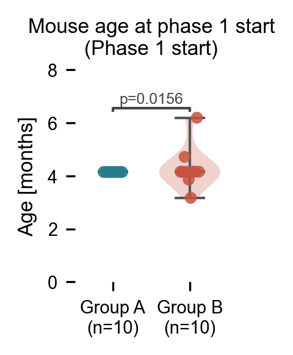

``time_unit`` can be ``"months"``, ``"days"``, or ``"years"``. ``show_N=True``
adds the group sample size to the x tick labels; this argument is available
for most plotting methods. 

General activity
----------------

The first behavioral QC plot is the full-experiment visit activity. It asks a
simple but important question: did all groups use the IntelliCage at comparable
levels across the protocol? If one group barely visits the corners, apparent
learning deficits may partly reflect low sampling rather than impaired spatial
learning:

.. code-block:: python

   my_pl_exp.plot_mice_activity(
       bin_hours            = 1, # 1, or 12, or 24...whatever suits your analysis. 
       phases               = "all", # all, or select specific phases (2,3), (3,4), etc.
       dayphase             = "all", # all, day, night
       phase_max_hours      = PHASE_MAX_HOURS,
       spread_metric        = "sem",
       plot_style           = "line",
       day_night_indicator  = ("aw", "sl"),
       base_font_size       = BASE_FONT_SIZE,
       figsize_cm           = TIMELINE_FIGSIZE_CM,
       plot_layout ={"legend_font_size":LEGEND_FONT_SIZE, 
                     "legend":True})

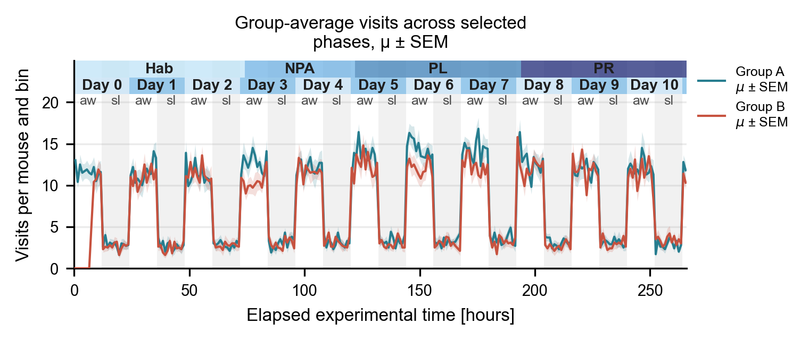

- ``bin_hours`` controls the time-bin width and is adjustable in units of hours. 
  In case you want to bin on half- or full-day-bases, set ``bin_hours=12`` or ``bin_hours=24``. 
  Analogously, set it to 24*7=168 for weekly bins.
- ``phases`` can be a single   phase number, or a tuple/list of phase numbers. 
- ``dayphase="all"`` is the recommended default for this overview because the purpose is 
  to inspect the complete activity rhythm. However, you can also choose ``dayphase="day"`` or 
  ``dayphase="night"`` to inspect only the day or night activity. 
- The ``day_night_indicator`` argument controls the labels for the background shading of 
  awake and sleep periods.  The default is ``("awake", "sleep")``, but you can also use 
  ``("aw", "sl")`` or any  other two strings that suit your analysis. 
- The ``plot_style`` argument can be set  to ``"line"`` (default) or ``"step"``. 
- With ``spread_metric="sem"``, the plot shows the  mean plus/minus the standard error 
  of the mean (SEM) across mice; alternatively,  you can set it to ``"std"`` to show 
  the standard deviation (STD) instead. 
- With ``base_font_size`` and ``figsize_cm``, you can adjust the font size and figure size 
  (in centimeters), respectively. 
- ``phase_max_hours`` is required to tell the function how many hours to include for 
  each phase; it is a dictionary with phase numbers as keys and maximum hours as values. 

All discussed arguments are available for most plotting methods.

Interpreting the plot: The panel shows group means plus SEM across the entire protocol. 
It is not a learning metric by itself; it tells you whether later rate differences
could be entangled with broad differences in visit activity. The phase and
awake/sleep bars help you see whether changes line up with protocol transitions
or with the animals' daily rhythm. In real cohorts, abrupt gaps or single-group
drops are often more important as data-quality signals than the exact height of
the activity curve.

The toolkit also provides a more compact phase-level summary of visit activity. 
It computes the mean visit rate per mouse and phase:

.. code-block:: python

  my_pl_exp.plot_phase_activity_summary(
    dayphase            = "all", # "all", "day", "night"
    phase_max_hours     = PHASE_MAX_HOURS,
    base_font_size      = BASE_FONT_SIZE,
    figsize_cm          = (6, 6.2),
    show_N              = True,
    xtick_rotation      = 0,
    median_line_width   = 0.8,
    median_marker_size  = 3.0,
    plot_layout={
        "legend": True,
        "legend_loc": "upper left",
        "legend_font_size": LEGEND_FONT_SIZE,
        "ylim": (0.0, 25),})

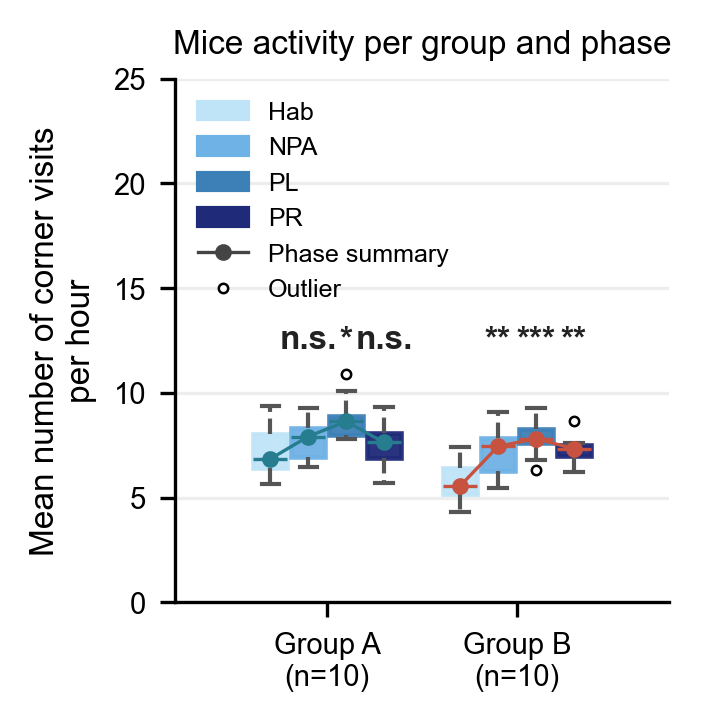

The statistical markers compare later phases against the baseline phase within
groups. In the synthetic data, this plot is mainly a guardrail: learning plots
should not be read without checking whether one group simply visited much less.
When this endpoint differs strongly between groups, rate-based plots should be
read alongside absolute-count plots because a stable rate based on very few
visits is less informative than the same rate based on frequent sampling.

Drinking behavior
-----------------

The drinking-control plots inspect whether mice interact with the cage and
bottles throughout the protocol. ``plot_NP_adaptation`` overlays all visits and
drink-positive visits. In the all-groups panel, all visits are drawn as solid
lines and drinking visits as dashed lines; when ``show_all_visits=False``, the
plot focuses on drinking visits only and draws them as solid group traces. In
single-group panels, ``single_group_display`` controls whether the plot shows
group mean plus spread or thin individual mouse traces with a thicker group
mean. ``show_all_groups_SEM`` adds shaded SEM or SD bands around group means in
the all-groups panel:

.. code-block:: python

   my_pl_exp.plot_NP_adaptation(
       phases               = "all", # "all", (2,4)
       bin_hours            = 1, # 1, or 12, or 24...whatever suits your analysis.
       dayphase             = "all", # "all", "day", "night"
       phase_max_hours      = PHASE_MAX_HOURS,
       spread_metric        = "sem",
       plot_style           = "line",
       show_all_visits      = True,
       show_all_groups_SEM  = False,
       single_group_display = "spread", # "spread" or "individual"
       base_font_size       = BASE_FONT_SIZE,
       figsize_cm           = TIMELINE_FIGSIZE_CM_NO_LEGEND,
       day_night_indicator  = ("aw", "sl"),
       plot_layout={"legend_font_size":LEGEND_FONT_SIZE, 
                    "legend":True})

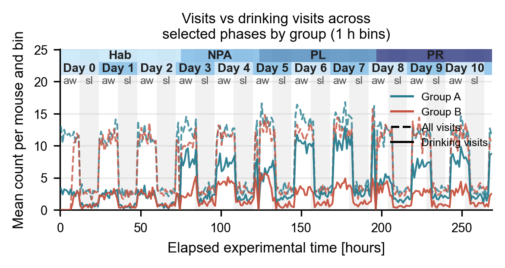

This plot may help distinguish poor task performance from poor cage engagement. If
one group rarely drinks or rarely visits, rate-based learning plots need extra
care. In a PL/PR experiment, this is also a useful check for the nose-poke
adaptation phase: animals should learn that corner interaction produces access
to drinking opportunities before later rewarded-corner metrics are interpreted.

Analogously, the toolkit can plot nose-poke and licking counts per mouse and bin
in the same manner:

.. code-block:: python

   my_pl_exp.plot_NP_counts(
       phases               = "all", #"all" (2,4), ...
       bin_hours            = 1, # 1, or 12, or 24...whatever suits your analysis.
       dayphase             = "all", # "all", "day", "night"
       phase_max_hours      = PHASE_MAX_HOURS,
       spread_metric        = "sem",
       plot_style           = "line",
       base_font_size       = BASE_FONT_SIZE,
       figsize_cm           = TIMELINE_FIGSIZE_CM_NO_LEGEND,
       day_night_indicator  = ("aw", "sl"),
       plot_layout={"legend_font_size":LEGEND_FONT_SIZE, 
                    "legend":True})

   my_pl_exp.plot_licking_counts(
       phases               = "all",
       bin_hours            = 1, 
       dayphase             = "all",
       phase_max_hours      = PHASE_MAX_HOURS,
       spread_metric        = "sem",
       plot_style           = "line",
       base_font_size       = BASE_FONT_SIZE,
       figsize_cm           = TIMELINE_FIGSIZE_CM_NO_LEGEND,
       day_night_indicator  = ("aw", "sl"),
       plot_layout={"legend_font_size":LEGEND_FONT_SIZE, 
                    "legend":True})

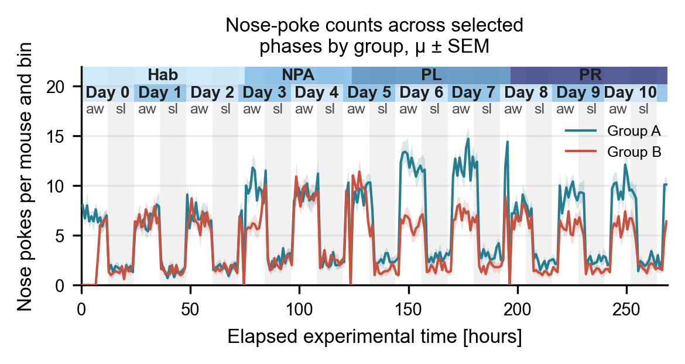

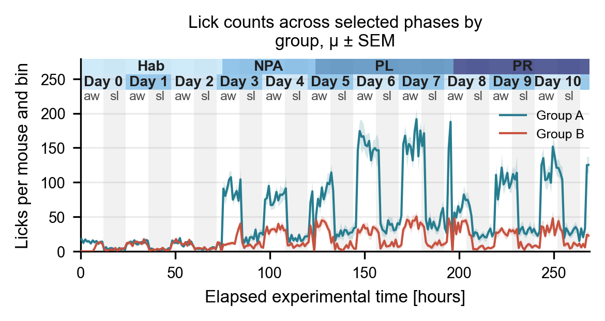

Together, these plots check whether nose-poking and licking are stable enough to
support nose-poke-aware learning metrics. They also help separate different
failure modes: low visits suggest reduced exploration or activity, low
nose-pokes suggest weak task interaction, and low lick counts suggest altered
drinking behavior or reward consumption.

Bottle preference
-----------------

Bottle preference is a generic analysis layer and can be combined with PL/PR or
any other experiment. The synthetic ``Nosepokes.txt`` files encode plain water on
the left bottle sides and saccharin on the right bottle sides. For each mouse
and bin, left and right consumption are summed from ``LickNumber``:

.. math::

   L_{mouse,bin} = \sum_{left\ side\ nosepokes} N_{licks}

.. math::

   R_{mouse,bin} = \sum_{right\ side\ nosepokes} N_{licks}

For ``calc="right_bottle/left_bottle"``, the plotted value is:

.. math::

   \mathrm{right\ preference}_{mouse,bin} = \frac{R_{mouse,bin}}{L_{mouse,bin}+R_{mouse,bin}}

The example loops over 24 h and 48 h bins:

.. code-block:: python

   BOTTLE_BIN_HOURS = [24, 2 * 24]
   for current_bin_hours in BOTTLE_BIN_HOURS:
       # current_bin_hours=BOTTLE_BIN_HOURS[0]
       my_pl_exp.plot_bottle_preference(
          phases              = "all",
          dayphase            = "day", # "all", "day", "night" - here, it makes most sense to use the day phase, 
                                      # because the mice are awake and active during the day. During night, they 
                                      # are mostly asleep and not drinking, which would confound the analysis.
                                      # You can inspect the night phase drinking behavior with the plots you
                                      # have just generated above.
          left_bottle         = "plain water", # define which bottle is the left and which is the right, based on your experimental setup
          right_bottle        = "saccharin",
          calc                = "right_bottle/left_bottle", # "all", "right_bottle/left_bottle", "left_bottle/right_bottle", "left_bottle", or "right_bottle"
          bin_h               = current_bin_hours,
          phase_max_hours     = PHASE_MAX_HOURS,
          spread_metric       = "sem",
          plot_style          = "line",
          base_font_size      = BASE_FONT_SIZE,
          x_unit              = "days", # days, hours, weeks - in case your bin_h is e.g. 1 week, choose "weeks" as x_unit. 
          indicate_dots       = True,
          calc_stats          = True,
          day_night_indicator = None, # ("aw", "sl") or None
          figsize_cm          = TIMELINE_FIGSIZE_CM_NO_LEGEND,
          plot_layout = {"xticks": np.arange(0,13,1),
                        "legend_loc": "best",
                        "legend_font_size":LEGEND_FONT_SIZE})

``day_night_indicator`` is optional and only controls the visual background:
``None`` keeps the plot uncluttered, while a tuple such as ``("aw", "sl")``
adds the same awake/sleep labels used in the activity plots. ``calc_stats=True``
adds a bin-wise group test on mouse-level bottle values. For two groups, each
bin is tested with Welch's t-test when both groups pass Shapiro-Wilk normality
checks and with Mann-Whitney U otherwise. For more than two groups, the function
uses one-way ANOVA for normally distributed bins and Kruskal-Wallis otherwise.
Significant bins are marked by ``*``, ``**``, or ``***``.

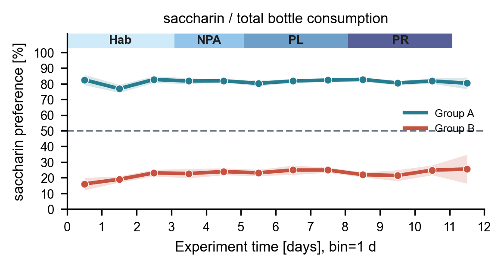

``calc`` also accepts ``"all"`` for total bottle consumption, ``"left_bottle"``
and ``"right_bottle"`` for side-specific raw licking counts, plus
``"left_bottle/right_bottle"`` for left preference. ``x_unit`` only changes axis
units, it does not change the binning itself. In the synthetic example, Group A
prefers saccharin, whereas Group B shows an anhedonia-like plain-water
preference.

This plot is intentionally experiment-agnostic. In a PL/PR workflow it can act
as a motivational or hedonic readout next to spatial learning. In a dedicated
bottle-preference experiment, the same function can become the main endpoint:
values above 0.5 indicate stronger right-bottle consumption, values below 0.5
indicate stronger left-bottle consumption, and flat curves near 0.5 indicate no
clear preference under the selected binning and dayphase filter.

For endpoint comparisons, use ``plot_bottle_preference_day``. It accepts the
same ``calc`` modes but collapses one experimental day into one mouse-level
value and renders a group violin plot. In the synthetic PL/PR example, Day 10 is
the final complete experiment day:

.. code-block:: python

   my_pl_exp.plot_bottle_preference_day(
       experiment_day  = 10,
       phases          = "all",
       dayphase        = "day",
       left_bottle     = "plain water",
       right_bottle    = "saccharin",
       calc            = "right_bottle/left_bottle",
       phase_max_hours = PHASE_MAX_HOURS,
       calc_stats      = True,
       base_font_size  = BASE_FONT_SIZE,
       figsize_cm      = (3.5, 5),
       show_N          = True,
       plot_layout={"ylim": (0.0, 120.0)})

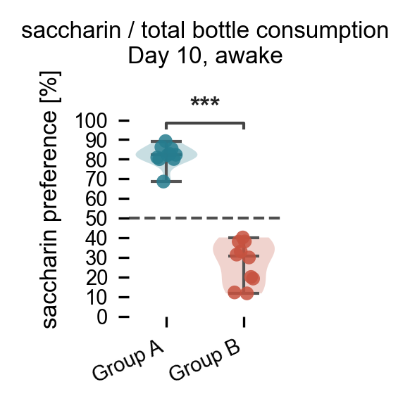

For total liquid uptake on the same day, switch to ``calc="all"``.

Learning and reversal behavior
------------------------------

The toolkit provides two functions that calculate the success and error rates for
place learning and reversal. The success rate is defined as the number of visits 
to the correct corner divided by all visits for each mouse, day phase (day, night, 
or both), and time bin:

.. math::

   \mathrm{success\ rate} =
   \frac{N_{success\ visits}}{N_{all\ visits}}

The matching error rate is the exact complement:

.. math::

   \mathrm{error\ rate} =
   \frac{N_{all\ visits}-N_{success\ visits}}
        {N_{all\ visits}}

Further, the toolkit provides three complementary metrics: for PL and PR.

- ``"correct_corner_visit"`` counts all visits to the assigned correct corner, 
- ``"correct_np_visit"`` requires a correct nose-poke visit, and 
- ``"rewarded_correct_corner_visit"`` requires the rewarded correct-corner event. 

In the error-rate function, the argument ``error_against="selected_success"`` 
means the error-rate plot is the complement of the selected metric; for rewarded 
metrics, use ``error_against="spatial_correct"`` when the question is only whether 
mice chose the wrong corner.

.. code-block:: python

   for current_phase in PLR_PHASES:
       # current_phase = PLR_PHASES[0]
       for current_metric in PLR_METRICS:
           # current_metric = PLR_METRICS[0]
           my_pl_exp.plot_plr_phase_segment_rate(
               phase_number     = current_phase,
               metric           = current_metric,
               dayphase         = "all", # all, day, night
               phase_max_hours  = PHASE_MAX_HOURS,
               spread_metric    = "sem",
               base_font_size   = BASE_FONT_SIZE,
               figsize_cm       = SEGMENT_FIGSIZE_CM_NO_LEGEND,
               plot_layout={"legend": True,
                            "legend_loc": "lower right",
                            "legend_font_size": LEGEND_FONT_SIZE})

           my_pl_exp.plot_plr_phase_segment_error_rate(
               phase_number     = current_phase,
               metric           = current_metric,
               error_against    = "selected_success",
               dayphase         = "all", # all, day, night
               phase_max_hours  = PHASE_MAX_HOURS,
               spread_metric    = "sem",
               base_font_size   = BASE_FONT_SIZE,
               figsize_cm       = SEGMENT_FIGSIZE_CM_NO_LEGEND,
               plot_layout={"legend": True,
                            "legend_loc": "lower right",
                            "legend_font_size": LEGEND_FONT_SIZE})

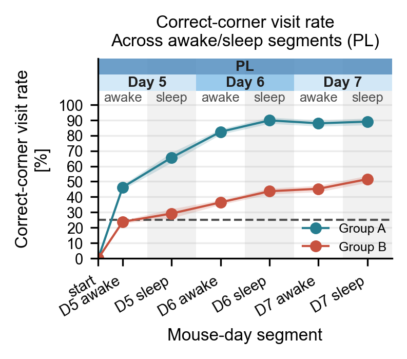

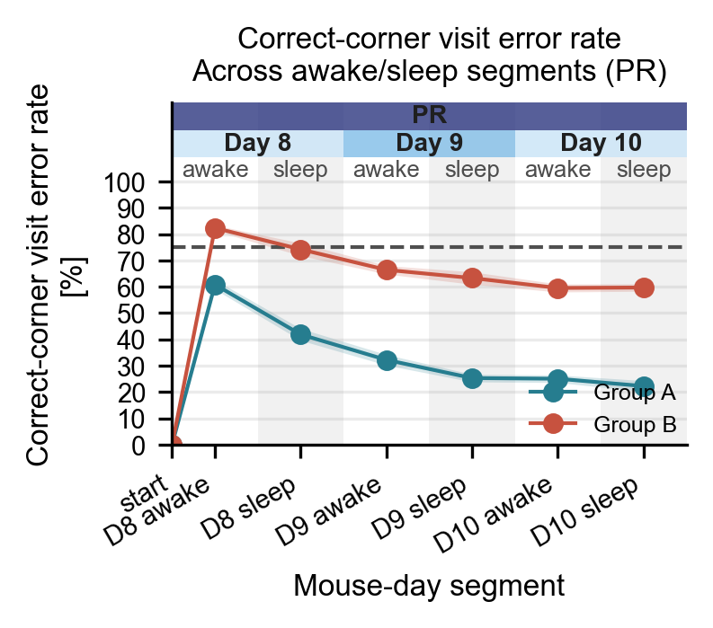

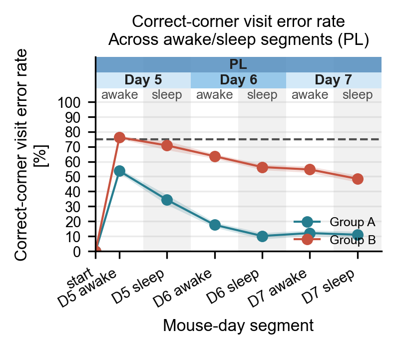

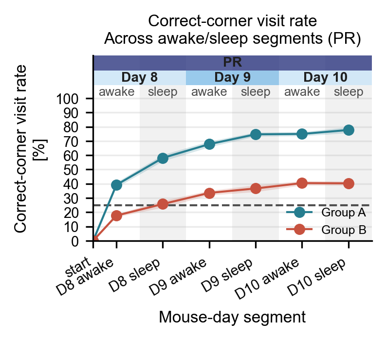

The dashed line in both plots indicates the chance level of 0.25/25% for a four-corner task
(0.75/75% for the error rate).

These plots are usually the first step in a PL/PR analysis. They show the time course of 
learning and reversal, i.e., how quickly the mice learn the correct corner and how quickly 
they adapt to the new correct corner after reversal. The segment plots are useful for 
visualizing the learning curves and comparing the performance across different groups.

Day-wise endpoints
------------------

Endpoint violins summarize mouse-level performance for specific phase days.
The statistical tests therein indicate whether the groups differ on the selected day
(displayed p-value) and whether the day-wise performance differs significantly 
from chance (dashed line, displayed asterisks):

.. code-block:: python

   for current_phase in PLR_PHASES:
       # current_phase = PLR_PHASES[0]
       for current_metric in PLR_METRICS:
           # current_metric = PLR_METRICS[0]
           my_pl_exp.plot_plr_awake_day_rate(
               phase_number=current_phase,
               metric=current_metric,
               phase_day=(1, 2, 3),
               dayphase="day", # all, day, night
               phase_max_hours=PHASE_MAX_HOURS,
               base_font_size=BASE_FONT_SIZE,
               figsize_cm=VIOLIN_FIGSIZE_CM,
               plot_layout={"legend": True,
                            "legend_loc": "lower right",
                            "legend_font_size": LEGEND_FONT_SIZE})
           my_pl_exp.plot_plr_awake_day_error_rate(
               phase_number=current_phase,
               metric=current_metric,
               error_against="selected_success",
               phase_day=(1, 2, 3),
               dayphase="day", # all, day, night
               phase_max_hours=PHASE_MAX_HOURS,
               base_font_size=BASE_FONT_SIZE,
               figsize_cm=VIOLIN_FIGSIZE_CM,
               plot_layout={"legend": True,
                            "legend_loc": "lower right",
                            "legend_font_size": LEGEND_FONT_SIZE})

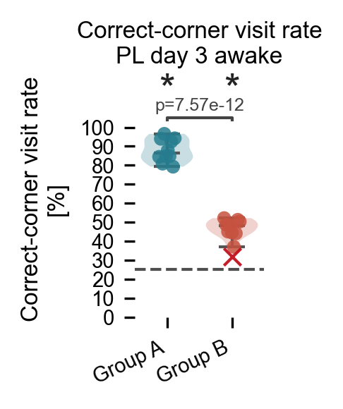

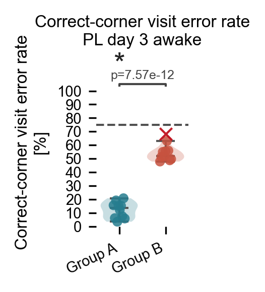

The day-wise endpoint view is often the clearest statistical comparison for a
predefined reporting day. In the synthetic data, the all-visit correct-corner
endpoint already shows the Group A versus Group B learning difference without
requiring nose-poke or reward-stringent filters. However, you can easily switch 
to the more stringent metrics if your experiment requires it (corresponding plots
not shown here).

Binned learning curves
----------------------

For finer timing, the toolkit offers an alternative equivalent to the 
``my_pl_exp.plot_plr_phase_segment_rate`` function. In ``plot_plr_learning_rate``,
the user can define the bin width in hours (``my_pl_exp.plot_plr_phase_segment_rate``
uses a fixed 12 h bin width). Additionally to the learning rate, the user can also 
plot the absolute counts of correct visits with
``my_pl_exp.plot_plr_learning_counts``. The two plots together provide a more
complete picture of the learning process and may help identify potential confounds:

.. code-block:: python

   for current_phase in PLR_PHASES:
       # current_phase=3
       for current_metric in PLR_METRICS:
           # current_metric=PLR_METRICS[0]
           my_pl_exp.plot_plr_learning_rate(
               phase_number     = current_phase,
               metric           = current_metric,
               bin_hours        = 1,
               dayphase         = "all", # all, day, night
               phase_max_hours  = PHASE_MAX_HOURS,
               spread_metric    = "sem",
               plot_style       = "line",
               base_font_size   = BASE_FONT_SIZE,
               figsize_cm       = PHASE_FIGSIZE_CM,
               plot_layout={"legend_font_size":LEGEND_FONT_SIZE, 
                            "legend":True})

           my_pl_exp.plot_plr_learning_counts(
               phase_number     = current_phase,
               metric           = current_metric,
               bin_hours        = 1,
               dayphase         = "all", # all, day, night
               phase_max_hours  = PHASE_MAX_HOURS,
               spread_metric    = "sem",
               plot_style       = "line",
               base_font_size   = BASE_FONT_SIZE,
               figsize_cm       = PHASE_FIGSIZE_CM,
               plot_layout={"legend_font_size":LEGEND_FONT_SIZE, 
                            "legend":True})

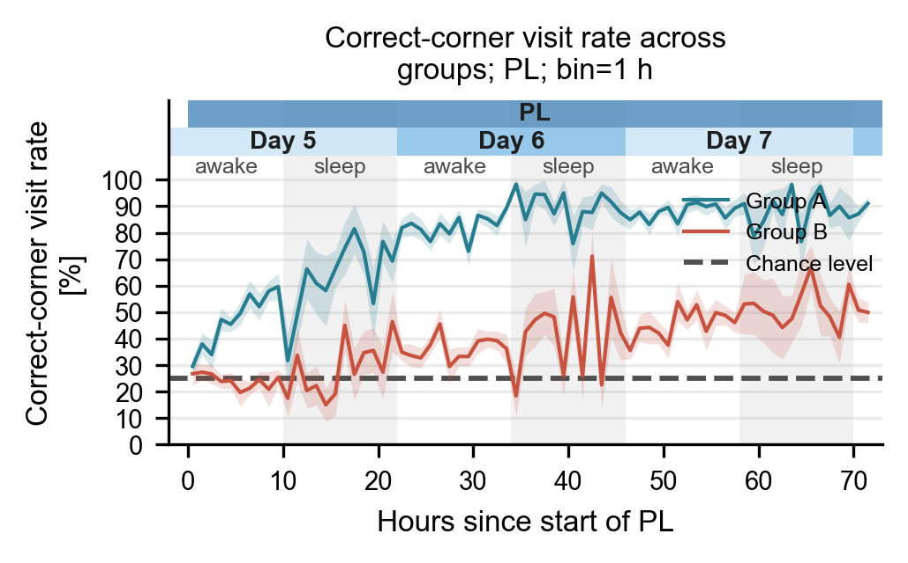

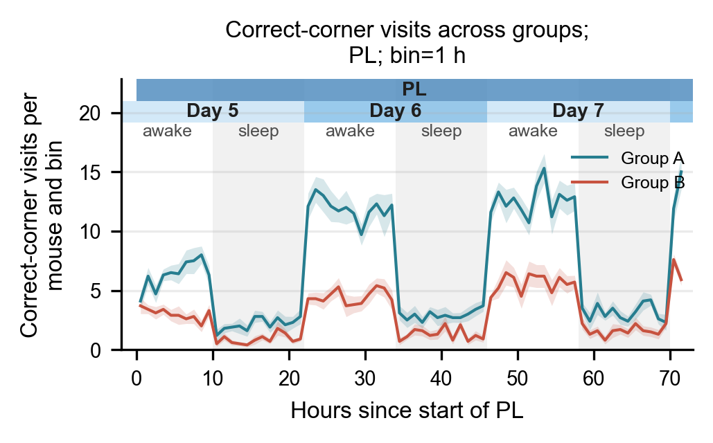

The rate plot emphasizes preference, while the count plot preserves activity
information. A convincing behavioral effect should make sense in both views:
for example, a high correct-corner rate with almost no correct visits may simply
mean that the denominator is small, whereas a rate increase accompanied by
increasing correct-visit counts is a stronger acquisition signal.

Reversal components
-------------------

For place reversal (PR), the toolkit separates PR-phase (in our example phase 4) visits 
into the new correct corner, the previously correct corner, and the two neutral corners:

.. code-block:: python

   my_pl_exp.plot_plr_reversal_components(
       phase_number   = 4,
       bin_hours      = 1,
       dayphase       = "all", # all, day, night
       phase_max_hours= PHASE_MAX_HOURS,
       spread_metric  = "sem",
       plot_style     = "line",
       base_font_size = BASE_FONT_SIZE,
       figsize_cm     = PHASE_FIGSIZE_CM_W_LEGEND,
       plot_layout={"legend_font_size":LEGEND_FONT_SIZE, 
                    "legend":True})

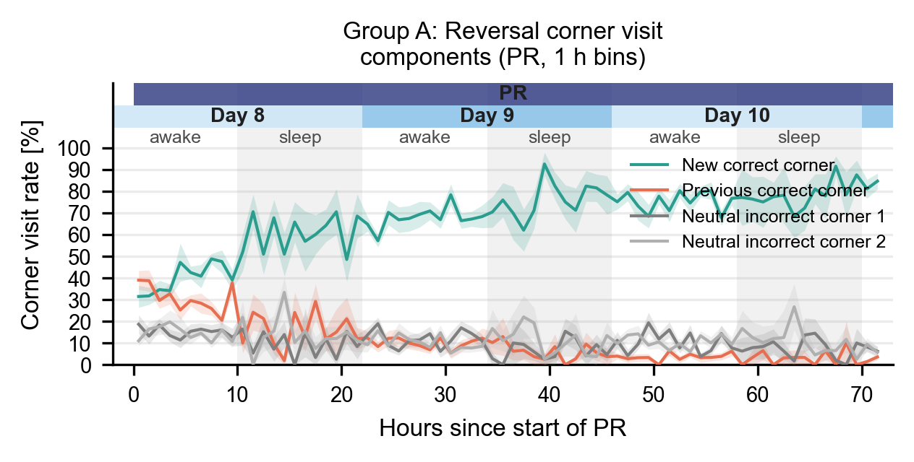

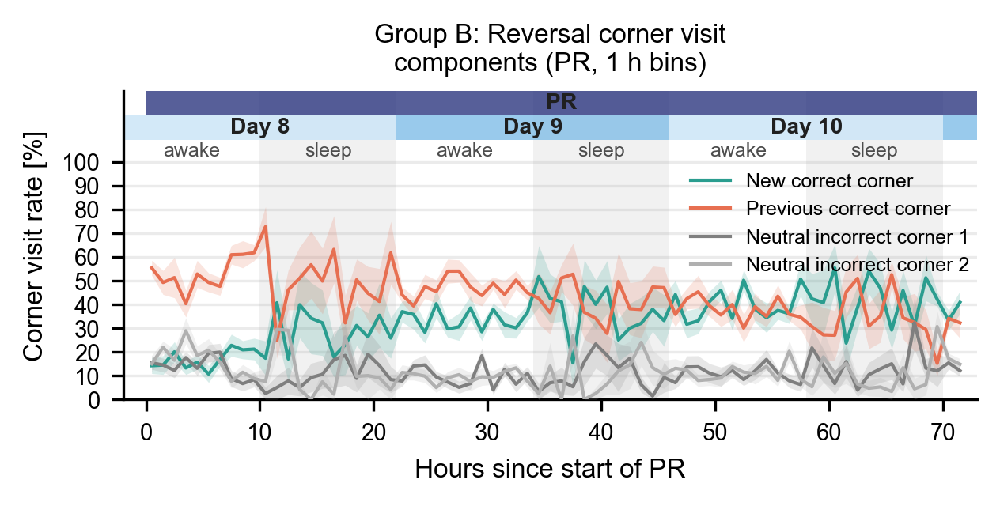

These plots distinguish weak new learning from perseveration. In the synthetic
data, Group B remains more attached to the previous correct corner and does only 
slowly learn the new correct corner, without really distinguishing between them.

Learning onset and experience
-----------------------------

Clock-time plots can be biased by activity. Experience-learning curves instead
ask how success develops as a function of visit number. The implementation uses
sliding visit windows over each mouse's chronologically sorted visits within the
selected phase. By default, each window contains :math:`20` visits and is valid only
when it contains at least :math:`20` visits.

For mouse :math:`m` and visit window :math:`w_k` beginning at visit index :math:`k`:

.. math::

   r_{m,k}
   = \frac{S_{m,k}}{A_{m,k}}
   = \frac{N_{\mathrm{success\ visits},m,w_k}}
          {N_{\mathrm{all\ visits},m,w_k}}

The x position of that window is the center of the visit window, so with the
default :math:`20`-visit window the first window is plotted at visit :math:`10`. The
experience-learning onset is the first window center where the success rate is
strictly above the internal threshold for :math:`3` consecutive windows:

.. math::

   v_{\mathrm{onset},m}
   = \min \left\{c_k:
       r_{m,k} > 0.40,\,
       r_{m,k+1} > 0.40,\,
       r_{m,k+2} > 0.40
     \right\}

where :math:`c_k` is the center visit number of window :math:`w_k`. If a mouse never
meets this criterion, its onset is stored as missing rather than forced to the
last visit.

.. code-block:: python

   for current_phase in PLR_PHASES:
       for current_metric in PLR_METRICS:
           my_pl_exp.plot_plr_experience_learning_curve(
               phase_number     = current_phase,
               metric           = current_metric,
               dayphase         = "day",
               phase_max_hours  = PHASE_MAX_HOURS,
               spread_metric    = "sem",
               base_font_size   = BASE_FONT_SIZE,
               figsize_cm       = TIMELINE_FIGSIZE_CM)

           my_pl_exp.plot_plr_experience_learning_onset(
               phase_number     = current_phase,
               metric           = current_metric,
               dayphase         = "day",
               phase_max_hours  = PHASE_MAX_HOURS,
               base_font_size   = BASE_FONT_SIZE,
               figsize_cm       = VIOLIN_FIGSIZE_CM,
               show_N           = True,
               plot_layout      = {"ylim": (0.0, None)})

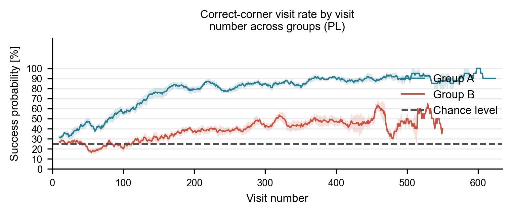

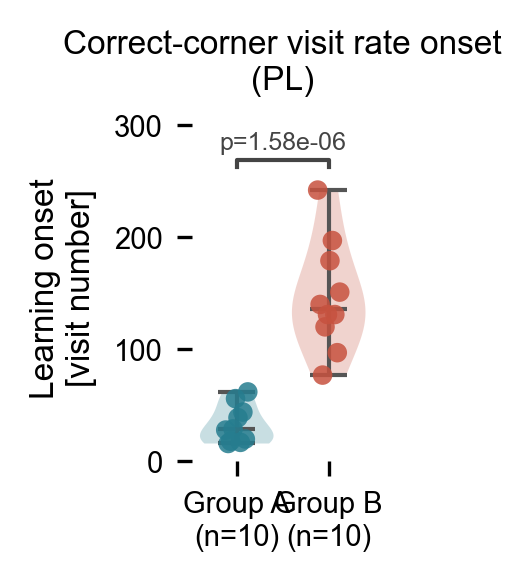

The curve removes elapsed-time differences in visit opportunity. The onset
violin then turns that trajectory into a mouse-level endpoint. This is
especially useful when groups differ in total activity: it asks whether mice
learn after a similar amount of task experience, independent of how quickly
they accumulated those visits in clock time.

Threshold onsets
----------------

Threshold-onset plots ask when a mouse first crosses a predefined binned rate in
clock time. They reuse the same binned mouse-level table as
``plot_plr_learning_rate``. For mouse :math:`m` and bin :math:`b`:

.. math::

   r_{m,b}
   = \frac{S_{m,b}}{A_{m,b}}
   = \frac{N_{\mathrm{success\ visits},m,b}}
          {N_{\mathrm{all\ visits},m,b}}

Bins with :math:`A_{m,b}=0` are ignored. For threshold :math:`\theta` in 
percent, the onset is the first valid bin whose rate is strictly above 
that threshold:

.. math::

   t_{\mathrm{onset},m}(\theta)
   = \min \left\{
       t_{\mathrm{start},b}:
       A_{m,b} > 0 \land r_{m,b} > \frac{\theta}{100}
     \right\}

If no bin crosses the threshold, the onset is stored as missing. Unlike the
experience-learning onset above, this endpoint does not require three
consecutive successful windows. It is a first-crossing metric whose temporal
resolution and stability depend on ``bin_hours``.

.. code-block:: python

   for current_threshold in RATE_THRESHOLD_PCTS:
       my_pl_exp.plot_plr_threshold_onset(
           phase_number     = current_phase,
           metric           = current_metric,
           threshold_pct    = current_threshold,
           bin_hours        = 1,
           dayphase         = "day",
           phase_max_hours  = PHASE_MAX_HOURS,
           base_font_size   = BASE_FONT_SIZE,
           figsize_cm       = VIOLIN_FIGSIZE_CM)

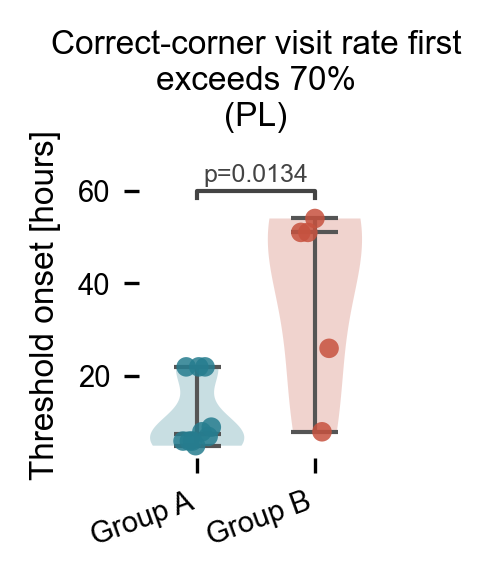

Lower thresholds such as 50% are useful for permissive responder screens.
70-80% thresholds are stricter and better suited for robust learning claims.
Because this onset is bin-based, it is best interpreted together with the
binned learning curve: a single early high-rate bin can be meaningful when it is
followed by sustained performance, but it can also occur by chance when visit
counts are sparse.

Derived ratios
--------------

Completion efficiency asks whether a mouse not only makes the correct
nose-poke response (= nose-pokes in its assigned corner), but also 
turns that response into a rewarded visit (i.e., also makes licks in that corner).
Suppose one mouse on one PL day:

* 30 visits contained a correct nose-poke response.
* 24 of those visits ended as rewarded correct-corner visits.

The completion efficiency for that mouse and day is therefore:

.. math::

   \mathrm{completion\ efficiency} = \frac{24}{30} = 0.8 = 80\%

More generally, for mouse :math:`m` on phase day :math:`d`:

.. math::

   \mathrm{completion\ efficiency}_{m,d}
   =
   \frac{N_{\mathrm{rew.\ corr.\ corner\ visits},m,d}}
        {N_{\mathrm{corr.\ nosep.\ visits},m,d}}

This is useful because a mouse may already perform the correct nose-poke
response but still fail to reliably complete the rewarded corner visit. A high
value therefore indicates that correct responses are efficiently translated
into rewarded task completion.

The function call below selects the two internal visit counters that correspond
to this behavioral question. The plotted value is multiplied by
``value_scale=100`` by default, so completion efficiency is shown as a
percentage:

.. code-block:: python

   my_pl_exp.plot_plr_derived_ratio(
       phase_number     = current_phase,
       numerator_col    = "rewarded_correct_corner_visit",
       denominator_col  = "correct_np_visit",
       metric_name      = "completion_efficiency",
       title            = "completion efficiency",
       ylabel           = "Rewarded correct / correct NP [%]",
       phase_day        = (1, 2, 3),
       dayphase         = "day",
       phase_max_hours  = PHASE_MAX_HOURS,
       base_font_size   = BASE_FONT_SIZE,
       figsize_cm       = VIOLIN_FIGSIZE_CM)

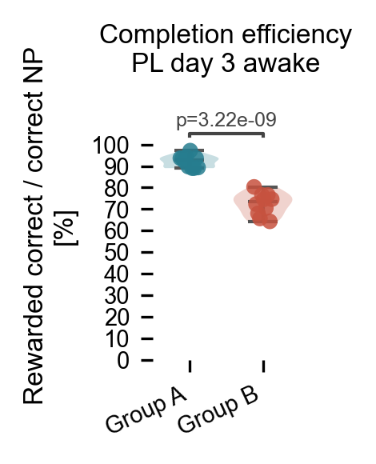

The reversal preference index asks a different question: after the reward
contingency changes in PR, does the mouse prefer the new correct corner, or
does it continue to return to the previously correct corner?
For example, imagine one mouse on one PR day:

* 20 visits went to the new correct corner.
* 30 visits went to the old, previously correct corner.
* 50 visits went to the two other corners.

For this index, the two other corners are ignored because the question is
specifically about the competition between the old and the new rule. The
reversal preference index is:

.. math::

   \mathrm{RPI} = \frac{20}{20 + 30} = 0.4

A value of :math:`0` means that the mouse visited only the previous correct
corner, :math:`0.5` means equal visits to old and new correct corners, and
:math:`1` means that the mouse visited only the new correct corner.

.. math::

   \begin{aligned}
   &\mathrm{RPI}_{m,d} = {} \\
   &\frac{N_{\mathrm{new\ corr.\ corner\ visits},m,d}}
        {N_{\mathrm{new\ corr.\ corner\ visits},m,d}
         + N_{\mathrm{prev.\ corr.\ corner\ visits},m,d}}
   \end{aligned}

.. code-block:: python

   my_pl_exp.plot_plr_derived_ratio(
       phase_number     = 4,
       numerator_col    = "correct_corner_visit",
       denominator_col  = "new_or_previous_correct_corner_visit",
       metric_name      = "reversal_preference_index", 
       title            = "reversal preference index",
       ylabel           = "New / (new + previous)",
       phase_day        = (1, 2, 3),
       dayphase         = "day",
       phase_max_hours  = PHASE_MAX_HOURS,
       value_scale      = 1.0,
       format_as_percent= False,
       reference_line   = 0.5,
       base_font_size   = BASE_FONT_SIZE,
       figsize_cm       = VIOLIN_FIGSIZE_CM,
       plot_layout      = {"ylim": (0.0, 1.5)})

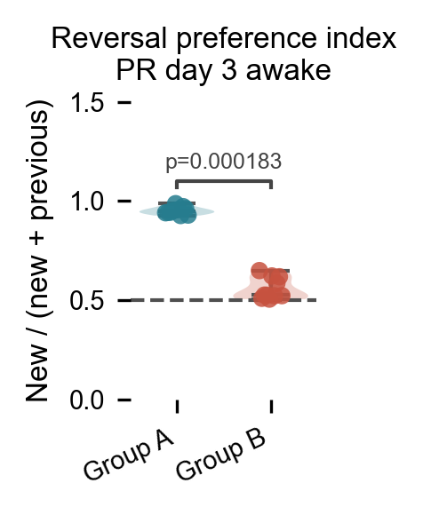

Cumulative corner preferences
-----------------------------

The cumulative role plot tracks how corner-role choices accumulate across
selected phases and marks the group-level learning onset. It is therefore both
a preference trajectory and an onset summary in one view.

For mouse :math:`m`, corner role :math:`r`, and elapsed time :math:`t`, the 
absolute curve is:

.. math::

   C_{m,r}(t)
   = \sum_{v:\ t_v \leq t}
     \mathbb{1}(\mathrm{corner\ role}_v = r)

The relative curve divides each role count by the cumulative number of all role
visits at the same time point:

.. math::

   P_{m,r}(t)
   = \frac{C_{m,r}(t)}
          {\sum_{r'} C_{m,r'}(t)}

The onset markers use the same clock-time sliding-window criterion as the
time-window learning implementation. For PL and PR separately, the toolkit
opens :math:`1` h windows every :math:`0.5` h within the target phase. A window is valid
when it contains at least :math:`5` visits. With :math:`S_{m,k}` success visits and
:math:`A_{m,k}` all visits in window :math:`k`:

.. math::

   r_{m,k} = \frac{S_{m,k}}{A_{m,k}}

The mouse-level clock-time onset is the first window start where three
consecutive valid windows are strictly above :math:`0.40`:

.. math::

   t_{\mathrm{onset},m}
   = \min \left\{a_k:
       r_{m,k} > 0.40,\,
       r_{m,k+1} > 0.40,\,
       r_{m,k+2} > 0.40
     \right\}

The marker shown in the cumulative plot is the median mouse onset of the group,
shifted to the selected phase's position on the combined phase x axis. This
differs from the experience-learning onset, which uses visit-number windows and
reports onset in visits. It also differs from threshold onset, which uses the
user-selected ``bin_hours`` table and requires only one bin above the requested
threshold.

.. code-block:: python

  my_pl_exp.plot_plr_cumulative_preferences(
    phases              = (2, 3, 4),
    dayphase            = "day",
    phase_max_hours     = PHASE_MAX_HOURS,
    spread_metric       = "sem",
    plot_style          = "line",
    day_night_indicator = ("aw", "sl"),
    output_dir          = RESULTS_ROOT / "plr_cumulative",
    base_font_size      = BASE_FONT_SIZE,
    figsize_cm          = CUMULATIVE_FIGSIZE_CM,
    plot_layout={"legend_font_size":LEGEND_FONT_SIZE, 
                 "legend":True})

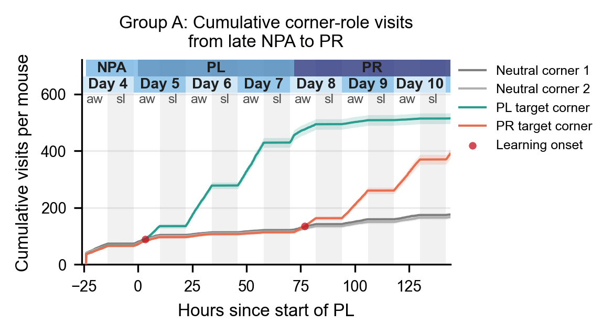

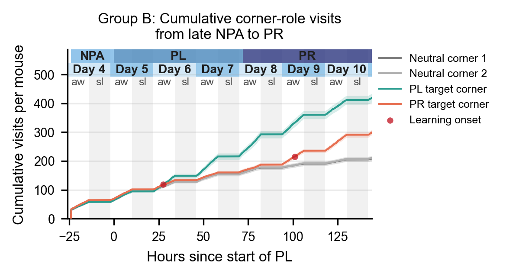

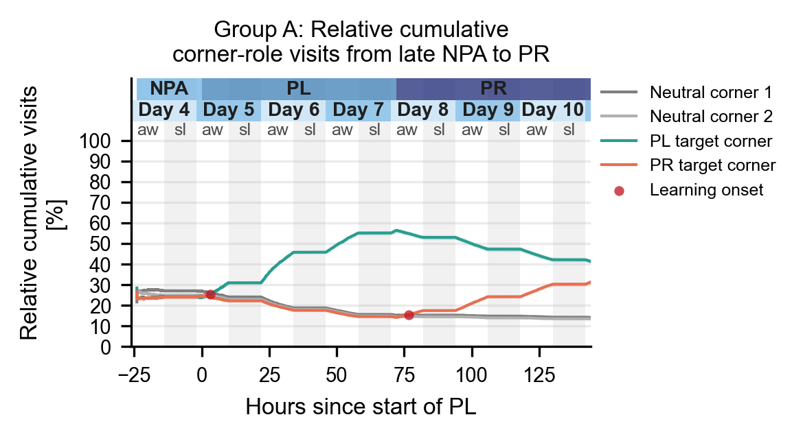

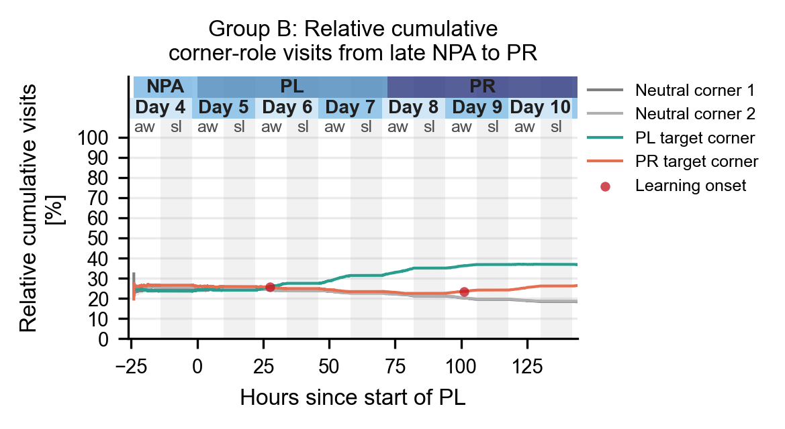

This view is particularly helpful in reversal experiments because it shows
whether the previous correct corner continues to dominate after the reward
contingency changes. In the synthetic example, the relative traces make old-rule
perseveration visible even before looking at day-wise endpoint statistics.

Reading the synthetic phenotype
-------------------------------

The  synthetic dataset was designed with a clear Group A versus Group B
difference. Group A has stronger initial place learning, better saccharin
preference, and a cleaner reversal shift. Group B has slower acquisition,
stronger old-corner persistence during phase 4, and an anhedonia-like
plain-water preference. The scientific messages of each figure are intentionally 
redundant: the same phenotype is visible in activity controls, rate plots, absolute counts,
endpoints, experience-normalized curves, and reversal component plots.
For real datasets, however, do not rely on a single preferred figure. A robust
interpretation should, in our view, survive at least three checks:

- overview and phase-activity plots do not reveal a trivial activity
  explanation;
- rate and absolute-count plots point in compatible directions;
- PR-phase deficits can be separated into new-corner learning, old-corner
  perseveration, and neutral-corner exploration.

Adapting the script
-------------------

For a new dataset, copy the structure of ``place_learning_example.py`` and
change the metadata and workflow settings first:

- ``EXPERIMENT["root_data_path"]`` and ``EXPERIMENT["results_data_path"]``
- ``PHASES`` entries for all protocol phases
- ``EXPERIMENT["group_names"]`` and ``EXPERIMENT["group_colors"]``
- ``SUBJECTS`` entries for all animals that should be analyzed
- subject-specific phase ``time_window`` entries
- phase-specific ``corner_assignments`` for PL/PR metrics
- ``phase_max_hours``
- ``EXPERIMENT["mouse_day"]``

Then check the base tables before interpreting group plots. In particular:

- confirm that ``metadata["Group"]`` contains the expected labels;
- confirm that every run group appears in ``phase_manifest.tsv``;
- inspect whether phase start/end times are plausible;
- verify that ``csv/merged_visits.tsv.gz`` contains non-empty phase 3 and phase 4
  rows;
- compare overview activity before interpreting learning-rate differences.

The package deliberately keeps these choices visible in user scripts. That
makes the analysis easier to review, rerun, and adapt when cohorts differ in
phase names, phase timing, or group structure.
